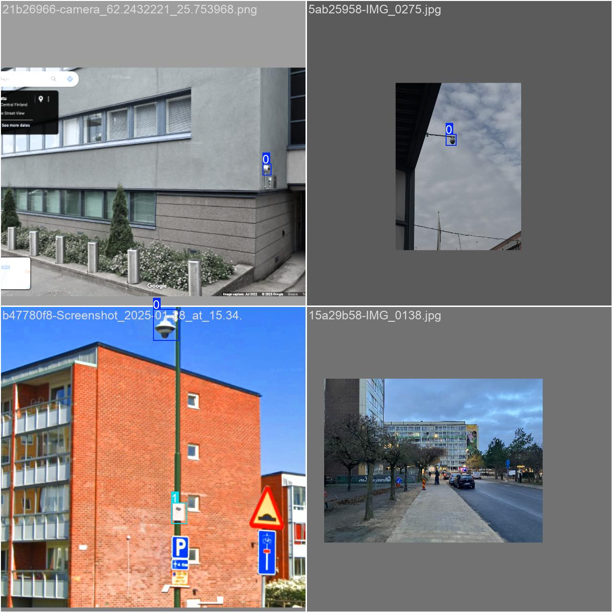

# This is the cctv detection application for the UNDO.

To run this project you need to create a virtual environment. Open up a terminal and type the following:

```commandline
python3.11 -m venv venv
```

Activate the newly created env:

```commandline
source "PATH-TO-VENV/venv/bin/activate"
```

If needed you can deactivate the virtual environment from within root of project:

```commandline
deactivate
```

Install the dependencies for this project:

```commandline
pip install -r requirements.txt
```

## Image labelling
To label images you need to have [Docker](https://www.docker.com) and [label-studio](https://labelstud.io) installed.

From a terminal run the following to pull the latest label-studio image:

```commandline
docker pull heartexlabs/label-studio:latest
```

To run the container:

```commandline
docker run -it -p 8080:8080 -v $(pwd)/mydata:/label-studio/data heartexlabs/label-studio:latest
```

Open your web browser and navigate to http://localhost:8080.
Upon first access, you’ll be prompted to create a username and password. 
This account is for local use only and does not require any external registration.

## Model training results

### Overview
We trained a YOLO model on our custom dataset for 20 epochs. The final evaluation metrics show strong performance with high precision, recall, and mAP, particularly at an IoU threshold of 0.5.

| Metric             | Value    |
|--------------------|----------|
| Epochs             | 20       |
| Training Loss      | 4.99     |
| Validation Loss    | 5.66     |
| Precision (B)      | 0.841    |
| Recall (B)         | 0.838    |
| mAP@0.5 (B)        | 0.873    |
| mAP@0.5:0.95 (B)   | 0.415    |

### Loss curves
Training and validation losses decreased steadily across epochs, showing no major overfitting:

- **Training Loss:** Decreased from ~8.0 to ~5.0.
- **Validation Loss:** Decreased from ~6.9 to ~5.7.
- **Gap between train and validation loss remained stable**, suggesting good generalization.

### Detection metrics
- **Precision** and **recall** improved steadily, reaching balanced high scores (above 83%).
- **mAP@0.5** (object detection quality at 0.5 IoU threshold) reached **87%**.
- **mAP@0.5–0.95** (stricter localization accuracy) reached **41%**, indicating moderate room for improvement in bounding box precision.

### Visualizations
Results


Training batch images



Valuation prediction samples


---

### Disclaimer
Although most images used in training have been collected through ethnographic research,
some images used in this project come from the dataset of the [Fuziih CCTV-Exposure](https://github.com/Fuziih/cctv-exposure/tree/main)

> Contact us if you want access to the dataset or the weights of the model.

## User Interface
The application has a User Interface for uploading images and using the custom trained YOLOv8 to detect CCTV images.
In order to do that `cd` into `src/presentation`, open upn a terminal and use:

```commandline
python main_ui.py
```

Then open up a browser and visit: `http://127.0.0.1:7860`.

## Testing 
In order to run the tests first:

```commandline
pip install -r requiremens_tests.txt
```

Then from the root project run:

```commandline
bash ./local_test_pipeline.sh
```

## Code formatting

This project uses [.pre-commit](https://pre-commit.com) hooks to ensure universal code formatting.

To install these use:

```commandline
pre-commit install
```

The hooks will run the [ruff](https://docs.astral.sh/ruff/) formatter with every commit.